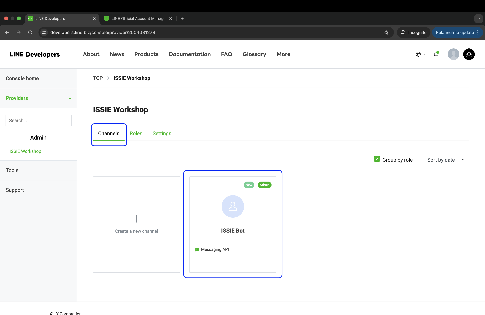
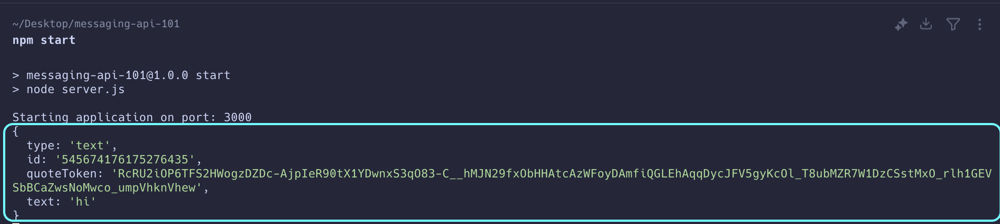
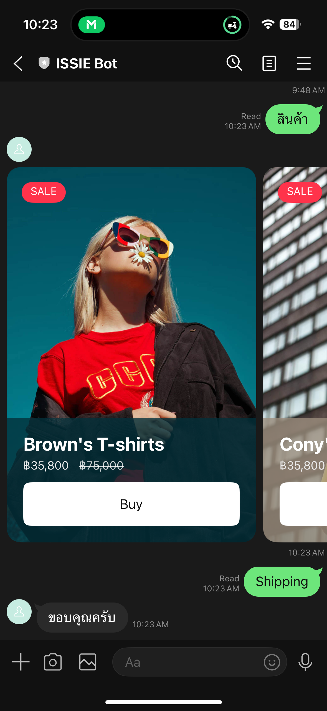

# Workshop 1 : LINE Messaging API Expert

ใน Workshop นี้ เราจะมาเรียนรู้พื้นฐานในการพัฒนา LINE Chatbot ด้วยภาษา Javascript และทดลองใช้งาน Feature ต่าง ๆ ของ LINE Messaging API ไม่ว่าจะเป็น Text Message, Flex Message, Quick Reply และ Loading Animation กัน

## Step 1 : Create LINE Channel

1. ลงชื่อเข้าใช้ [Line Developer Console](https://developers.line.biz/)


2. หลังจากลงชื่อเข้าใช้แล้ว เราจะต้องเริ่มจากการสร้าง Provider กันก่อน แนะนำให้กรอกข้อมูลตามตัวอย่าง


3. ต่อไปต้องสร้าง Messaging API Channel แต่เราจำเป็นที่จะต้องมี LINE Official Account (LINE OA) ก่อน


4. หลังจากที่เราเข้ามายัง LINE Official Account Manager แล้ว ให้ไปที่ Setting เพื่อเปิดใช้งาน Messaging API ของ Provider ที่เราพึ่งสร้างขึ้นมา


5. จากนั้นกลับมาที่ LINE Developer Console และคลิกไปที่ ​Provider ของเราด้านซ้ายมือ จะเห็นว่ามี Messaging API Channel ที่เราพึ่งสร้างไปขึ้นมาแล้ว




เมื่อคลิกเข้าไปที่ Channel จะมี `Channel secret` และ `Channel access token` ที่เราจะนำไปใช้ใน Code ของเราต่อไป


6. ทำการปิด Auto-reply messages


7. ทำการเพิ่มเพื่อนบอทด้วย QR Code ที่แสดงอยู่ใน Messaging API tab


## Step 2 : Setup LINE Webhook

ขั้นตอนต่อไป เราจะมาทำ Webhook กัน โดยเราจะนำ `Channel secret` และ `Channel access token` ที่ได้มาจากพาร์ทที่แล้วมาใส่แอปพลิเคชันของเรา และใช้ Ngrok เพื่อทำ port forwarding เปิด URL จาก localhost ของเราเป็น Public

1. Clone Project ด้วยคำสั่ง

```bash
git clone https://github.com/ISSIE-Tech/messaging-api-starter.git
```

2. รันคำสั่งด้านล่าง เพื่อ Install Dependencies

```bash
npm install
```

3. เปิด Project ขึ้นมาใน VSCODE


4. นำ `Channel secret` และ `Channel access token` ที่ได้มาจากพาร์ทที่แล้วมาใส่


5. ใช้คำสั่งด้านล่าง เพื่อทำการ Start Application

```bash
npm start
```


จะเห็นว่า Application ของเราจะรันอยู่บน Port ที่กำหนดไว้ในโค้ด นั่นคือ Port 3000

6. ใช้คำสั่งจาก Ngrok เพื่อเปิด localhost:3000 ของเราให้เป็น Public

```bash
ngrok http 3000
```


7. เพิ่ม Webhook Url บน Line Developer Console ด้วย `${public_url}/callback` ซึ่งเป็น path ที่เขียนอยู่บนโค้ดของเรา แล้วทำการเปิด webhook และกดปุ่ม Verify


จะต้องได้ Success กลับมาหากได้ status อื่นให้ทำการเรียกพี่ TA ได้เลย

## Step 3 : Reply Text Message

สเต็ปต่อมาเราจะมาลองตอบกลับผู้ใช้ด้วย Text Message กัน โดยจะเริ่มจากให้บอทตอบคำว่า "ขอบคุณครับ" ไม่ว่าผู้ใช้จะทักมาว่าอะไรก็ตาม

1. ก่อนอื่นให้ทำการเพิ่มฟังก์ชันในการ handle request ตามโค้ดด้านล่างนี้ก่อน

โดยโค้ดด้านล่างนี้ จะใช้สำหรับ handle request ที่่เข้ามา และมีการ log event.message ออกมาบน console

ถ้าไม่เข้าใจโค้ดด้านล่างนี้ ให้ถาม chatGPT ดูก่อน ถ้ายังไม่เข้าใจให้ยกมือเรียกพี่ TA !! อย่าไปต่อ

```js
// register a webhook handler with middleware
app.post("/callback", line.middleware(config), async (req, res) => {
  try {
    const results = await Promise.all(req.body.events.map(handleEvent));
    res.send(results);
  } catch (err) {
    console.error("Error handling events:", err);
    res.status(500).send();
  }
});

async function handleEvent(event) {
  console.log(event.message);
  return 1;
}
```


จากนั้นกด save file และรันคำสั่ง `npm start` ใหม่ (เราต้อง restart server ใหม่ทุกครั้งที่เราทำการแก้โค้ด) แล้วลองทักอะไรก็ได้ไปหาบอท ในตัวอย่างนี้จะลองทักหา bot ด้วยคำว่า `hi`




สังเกต log ที่แสดงออกมาบน console ของเรา นั่นคือสิ่งที่อยู่ `event.message` ที่โค้ดของเราสั่งให้แสดงออกมา

- type : มีค่าเป็น `text` เพราะเราส่ง text ไปหาบอท ซึ่งจริง ๆ ก็จะมี type อื่น ๆ อีกเช่น `image`, `video`, `audio`, `sticker`, `file`, และ `location`

- text : คำพูดที่ผู้ใช้ส่งมาหาบอทของเรา

2. ต่อมาเราจะลองให้บอทตอบกลับผู้ใช้กัน เมื่อผู้ใช้พิมพ์ทักหาบอทของเรา เราจะให้บอทตอบกลับคำว่า "ขอบคุณครับ"

```js
async function handleEvent(event) {
  switch (event.message.type) {
    case "text":
      sendArigato(event);
      break;
    default:
      return null;
  }
}

function sendArigato(event) {
  const message = { type: "text", text: "ขอบคุณครับ" };

  return client.replyMessage({
    replyToken: event.replyToken,
    messages: [message],
  });
}
```


3. สังเกตว่า `messages` ที่อยู่ในฟังก์ชัน `client.replyMessage` นั้นรับเป็น Arrays นั่นหมายความว่าเราสามารถตอบกลับผู้ใช้ด้วยข้อความหลาย ๆ อันได้ (สูงสุด 5 messages)

```js
function sendArigato(event) {
  const message = { type: "text", text: "ขอบคุณครับ" };

  return client.replyMessage({
    replyToken: event.replyToken,
    messages: [message, message, message, message, message],
  });
}
```


4. ต่อมา เมื่อผู้ใช้ทักมาว่า "ขอบคุณ" เราจะให้บอทของเราตอบกลับผู้ใช้ว่า "ไม่เป็นไร"

```js
async function handleEvent(event) {
  switch (event.message.type) {
    case "text":
      handleTextMessage(event);
      break;
    default:
      return null;
  }
}

function handleTextMessage(event) {
  if (event.message.text === "ขอบคุณ") return sendDaiJoBu(event);

  return sendArigato(event);
}

function sendDaiJoBu(event) {
  const message = { type: "text", text: "ไม่เป็นไร" };

  return client.replyMessage({
    replyToken: event.replyToken,
    messages: [message],
  });
}

function sendArigato(event) {
  const message = { type: "text", text: "ขอบคุณครับ" };

  return client.replyMessage({
    replyToken: event.replyToken,
    messages: [message],
  });
}
```


ลองทบทวนโค้ดทั้งหมดดูอีกที หากมีข้อสงสัย แนะนำให้เรียกพี่ TA มาสอบถามก่อน อย่าพึ่งไปต่อ

## Step 4 : Reply Flex Carousel Message

ในพาร์ทนี้เราจะมาลองตอบกลับ Flex Message แบบ Carousel กลับไปหาผู้ใช้กัน

1. เพิ่มฟังก์ชัน `sendCarousel()` ตามโค้ดด้านล่างเข้าไปที่ด้านล่่างสุดของไฟล์

```js
function sendCarousel(event) {
  const carousel = {
    type: "flex",
    altText: "this is a flex message",
    contents: {
      type: "carousel",
      contents: [
        {
          type: "bubble",
          body: {
            type: "box",
            layout: "vertical",
            contents: [
              {
                type: "image",
                url: "https://developers-resource.landpress.line.me/fx/clip/clip1.jpg",
                size: "full",
                aspectMode: "cover",
                aspectRatio: "2:3",
                gravity: "top",
              },
              {
                type: "box",
                layout: "vertical",
                contents: [
                  {
                    type: "box",
                    layout: "vertical",
                    contents: [
                      {
                        type: "text",
                        text: "Brown's T-shirts",
                        size: "xl",
                        color: "#ffffff",
                        weight: "bold",
                      },
                    ],
                  },
                  {
                    type: "box",
                    layout: "baseline",
                    contents: [
                      {
                        type: "text",
                        text: "฿35,800",
                        color: "#ebebeb",
                        size: "sm",
                        flex: 0,
                      },
                      {
                        type: "text",
                        text: "฿75,000",
                        color: "#ffffffcc",
                        decoration: "line-through",
                        gravity: "bottom",
                        flex: 0,
                        size: "sm",
                      },
                    ],
                    spacing: "lg",
                  },
                ],
                position: "absolute",
                offsetBottom: "0px",
                offsetStart: "0px",
                offsetEnd: "0px",
                backgroundColor: "#03303Acc",
                paddingAll: "20px",
                paddingTop: "18px",
              },
              {
                type: "box",
                layout: "vertical",
                contents: [
                  {
                    type: "text",
                    text: "SALE",
                    color: "#ffffff",
                    align: "center",
                    size: "xs",
                    offsetTop: "3px",
                  },
                ],
                position: "absolute",
                cornerRadius: "20px",
                offsetTop: "18px",
                backgroundColor: "#ff334b",
                offsetStart: "18px",
                height: "25px",
                width: "53px",
              },
            ],
            paddingAll: "0px",
          },
        },
        {
          type: "bubble",
          body: {
            type: "box",
            layout: "vertical",
            contents: [
              {
                type: "image",
                url: "https://images.pexels.com/photos/1183266/pexels-photo-1183266.jpeg?auto=compress&cs=tinysrgb&w=1260&h=750&dpr=2",
                size: "full",
                aspectMode: "cover",
                aspectRatio: "2:3",
                gravity: "top",
              },
              {
                type: "box",
                layout: "vertical",
                contents: [
                  {
                    type: "box",
                    layout: "vertical",
                    contents: [
                      {
                        type: "text",
                        text: "Cony's hoodie",
                        size: "xl",
                        color: "#ffffff",
                        weight: "bold",
                      },
                    ],
                  },
                  {
                    type: "box",
                    layout: "baseline",
                    contents: [
                      {
                        type: "text",
                        text: "฿35,800",
                        color: "#ebebeb",
                        size: "sm",
                        flex: 0,
                      },
                      {
                        type: "text",
                        text: "฿75,000",
                        color: "#ffffffcc",
                        decoration: "line-through",
                        gravity: "bottom",
                        flex: 0,
                        size: "sm",
                      },
                    ],
                    spacing: "lg",
                  },
                ],
                position: "absolute",
                offsetBottom: "0px",
                offsetStart: "0px",
                offsetEnd: "0px",
                backgroundColor: "#9C8E7Ecc",
                paddingAll: "20px",
                paddingTop: "18px",
              },
              {
                type: "box",
                layout: "vertical",
                contents: [
                  {
                    type: "text",
                    text: "SALE",
                    color: "#ffffff",
                    align: "center",
                    size: "xs",
                    offsetTop: "3px",
                  },
                ],
                position: "absolute",
                cornerRadius: "20px",
                offsetTop: "18px",
                backgroundColor: "#ff334b",
                offsetStart: "18px",
                height: "25px",
                width: "53px",
              },
            ],
            paddingAll: "0px",
          },
        },
      ],
    },
  };

  return client.replyMessage({
    replyToken: event.replyToken,
    messages: [carousel],
  });
}
```

และแก้ไข function `handleTextMessage()` ให้ call function `sendCarousel()` เมื่อผู้ใช้พิมพ์มาว่า "สินค้า"

```js
function handleTextMessage(event) {
  if (event.message.text === "ขอบคุณ") return sendDaiJoBu(event);
  if (event.message.text === "สินค้า") return sendCarousel(event);

  return sendArigato(event);
}
```


ทำการ save file และ restart server แล้วลองทักหาบอทว่า "สินค้า" ดู


แนะนำให้ลองดูภาพรวมของโค้ดตอนนี้อีกที ก่อนที่จะไปต่อ

2. ลองเพิ่มปุ้มให้ Flex Bubble กัน ทำการแก้ไข function `sendCarousel()` ตามโค้ดด้านล่าง (Copy ไปวางทับได้เลย)

```js
function sendCarousel(event) {
  const carousel = {
    type: "flex",
    altText: "this is a flex message",
    contents: {
      type: "carousel",
      contents: [
        {
          type: "bubble",
          body: {
            type: "box",
            layout: "vertical",
            contents: [
              {
                type: "image",
                url: "https://developers-resource.landpress.line.me/fx/clip/clip1.jpg",
                size: "full",
                aspectMode: "cover",
                aspectRatio: "2:3",
                gravity: "top",
              },
              {
                type: "box",
                layout: "vertical",
                contents: [
                  {
                    type: "box",
                    layout: "vertical",
                    contents: [
                      {
                        type: "text",
                        text: "Brown's T-shirts",
                        size: "xl",
                        color: "#ffffff",
                        weight: "bold",
                      },
                    ],
                  },
                  {
                    type: "box",
                    layout: "baseline",
                    contents: [
                      {
                        type: "text",
                        text: "฿35,800",
                        color: "#ebebeb",
                        size: "sm",
                        flex: 0,
                      },
                      {
                        type: "text",
                        text: "฿75,000",
                        color: "#ffffffcc",
                        decoration: "line-through",
                        gravity: "bottom",
                        flex: 0,
                        size: "sm",
                      },
                    ],
                    spacing: "lg",
                  },
                  {
                    type: "box",
                    layout: "vertical",
                    contents: [
                      {
                        type: "button",
                        action: {
                          type: "message",
                          label: "Buy",
                          text: "Shipping",
                        },
                        margin: "lg",
                        style: "secondary",
                        color: "#FFFFFF",
                      },
                    ],
                  },
                ],
                position: "absolute",
                offsetBottom: "0px",
                offsetStart: "0px",
                offsetEnd: "0px",
                backgroundColor: "#03303Acc",
                paddingAll: "20px",
                paddingTop: "18px",
              },
              {
                type: "box",
                layout: "vertical",
                contents: [
                  {
                    type: "text",
                    text: "SALE",
                    color: "#ffffff",
                    align: "center",
                    size: "xs",
                    offsetTop: "3px",
                  },
                ],
                position: "absolute",
                cornerRadius: "20px",
                offsetTop: "18px",
                backgroundColor: "#ff334b",
                offsetStart: "18px",
                height: "25px",
                width: "53px",
              },
            ],
            paddingAll: "0px",
          },
        },
        {
          type: "bubble",
          body: {
            type: "box",
            layout: "vertical",
            contents: [
              {
                type: "image",
                url: "https://images.pexels.com/photos/1183266/pexels-photo-1183266.jpeg?auto=compress&cs=tinysrgb&w=1260&h=750&dpr=2",
                size: "full",
                aspectMode: "cover",
                aspectRatio: "2:3",
                gravity: "top",
              },
              {
                type: "box",
                layout: "vertical",
                contents: [
                  {
                    type: "box",
                    layout: "vertical",
                    contents: [
                      {
                        type: "text",
                        text: "Cony's hoodie",
                        size: "xl",
                        color: "#ffffff",
                        weight: "bold",
                      },
                    ],
                  },
                  {
                    type: "box",
                    layout: "baseline",
                    contents: [
                      {
                        type: "text",
                        text: "฿35,800",
                        color: "#ebebeb",
                        size: "sm",
                        flex: 0,
                      },
                      {
                        type: "text",
                        text: "฿75,000",
                        color: "#ffffffcc",
                        decoration: "line-through",
                        gravity: "bottom",
                        flex: 0,
                        size: "sm",
                      },
                    ],
                    spacing: "lg",
                  },
                  {
                    type: "box",
                    layout: "vertical",
                    contents: [
                      {
                        type: "button",
                        action: {
                          type: "message",
                          label: "Buy",
                          text: "Shipping",
                        },
                        margin: "lg",
                        style: "secondary",
                        color: "#FFFFFF",
                      },
                    ],
                  },
                ],
                position: "absolute",
                offsetBottom: "0px",
                offsetStart: "0px",
                offsetEnd: "0px",
                backgroundColor: "#9C8E7Ecc",
                paddingAll: "20px",
                paddingTop: "18px",
              },
              {
                type: "box",
                layout: "vertical",
                contents: [
                  {
                    type: "text",
                    text: "SALE",
                    color: "#ffffff",
                    align: "center",
                    size: "xs",
                    offsetTop: "3px",
                  },
                ],
                position: "absolute",
                cornerRadius: "20px",
                offsetTop: "18px",
                backgroundColor: "#ff334b",
                offsetStart: "18px",
                height: "25px",
                width: "53px",
              },
            ],
            paddingAll: "0px",
          },
        },
      ],
    },
  };

  return client.replyMessage({
    replyToken: event.replyToken,
    messages: [carousel],
  });
}
```

จะเห็นว่า Flex Bubble ของเราจะมีปุ่ม "Buy" เพิ่มขึ้นมา และเมื่อเรากดปุ่มแล้ว ก็จะมี message คำว่า "Shipping" ส่งไปหาบอท จากนั้นบอทก็จะตอบคำว่า "ขอบคุณครับ" กลับมา ตามที่เราเคยเขียนเอาไว้



## Step 5 : Quick Reply & Location

ในพาร์ทนี้เราจะให้บอทของเราตอบกลับ message แบบ Quick Reply เพื่อให้ผู้ใช้ส่ง Shipping Location กลับมาให้บอทของเรากัน

1. เริ่มจากเพื่มโค้ดให้บอทของเรา ส่ง Quick Reply ขอ location จากผู้ใช้ เมื่อผู้ใช้ทักมาว่า "Shipping"

ทำการเพิ่ม function `sendQuickReply()` ไปยังด้านล่างสุดของไฟล์

```js
function sendQuickReply(event) {
  const quickReply = {
    type: "text",
    quickReply: {
      items: [
        {
          type: "action",
          action: {
            type: "location",
            label: "Location",
          },
        },
      ],
    },
    text: "เลือกที่อยู่จัดส่ง",
  };

  return client.replyMessage({
    replyToken: event.replyToken,
    messages: [quickReply],
  });
}
```

และทำการเพิ่ม condition ใน function `handleTextMessage()`

```js
if (event.message.text === "Shipping") return sendQuickReply(event);
```


จากนั้นลองทดสอบดูอีกครั้ง จะให้ว่ามี Quick Reply โผล่ขึ้นมาให้เราสามารถเลือก Location ได้


เมื่อเราทำการเลือก Location แล้ว ให้กดปุ่ม Share จะเป็นการส่ง Location ไปหาบอท


2. ที่ผ่านมาเราให้บอทของเราจัดการกับ message ที่มี type เป็น "text" มาตลอด ต่อมาเราจะให้บอทของเราตอบกลับผู้ใช้ถ้า message มี type เป็น "location" ด้วย

ทำการเพิ่ม function `handleLocation()` ไปที่ท้ายสุดของไฟล์

```js
function handleLocation(event) {
  const message = {
    type: "text",
    text: `ที่อยู่จัดส่งของคุณคือ ${event.message.title}`,
  };

  return client.replyMessage({
    replyToken: event.replyToken,
    messages: [message],
  });
}
```

แล้วทำการแก้ไข function `handleEvent()` ให้เรียก function `handleLocation()` เมื่อ type ของ message เป็น "location"

```js
async function handleEvent(event) {
  switch (event.message.type) {
    case "text":
      handleTextMessage(event);
      break;
    case "location":
      handleLocation(event);
      break;
    default:
      return null;
  }
}
```


เมื่อเราส่ง Location ไปให้บอท บอทก็จะตอบกลับที่อยู่จัดส่งของเรา


> แนะนำให้ลอง log event.message ใน function handleLocation() ออกมาดู เพื่อดูว่านอกจาก title แล้วเราได้ข้อมูลอะไรมาอีกบ้าง

## Step 6 : Loading Animation

ต่อมา เราจะมาลองฟีเจอร์ที่พึ่งเปิดตัวมาไม่นาน นั่นคือการแสดงผล Loading Animation

1. เพิ่มโค้ดด้านล่างนี้ ไปใน function `handleEvent()`

```js
await client.showLoadingAnimation({
  chatId: event.source.userId,
  loadingSeconds: 5,
});
```


ไม่ว่าเราจะพิมพ์อะไรไปหาบอทก็ตาม ก็จะมี Loading Animation ขึ้นมาก่อนแปบนึง


## Step 7 : Rich Menu

สุดท้าย เราจะมาลองเพิ่ม Rich Menu ให้กับ LINE OA ของเรากัน โดยเราจะทำปุ่มง่าย ๆ ที่เมื่อกดแล้ว จะให้ส่งคำว่า "สินค้า" ไปหาบอท

1. ไปที่ https://manager.line.biz/ แล้วเปิด LINE OA ของเราขึ้นมา ไปที่ tab Rich menus และกด "Create a rich menu"


2. ทำการกรอกข้อมูล


เมื่อกด Save แล้วรอมันเคลีย cache ซักครู่ แล้วเราจะเห็น ​Rich Menu ของเราโผล่ขึ้นมาใน LINE OA

เมื่อเราทำการกดที่ Rich Menu ก็จะมีคำว่า "สินค้า" ส่งไปหาบอท และบอทก็จะตอบกลับ Flex Carousel กลับมาให้เรา


